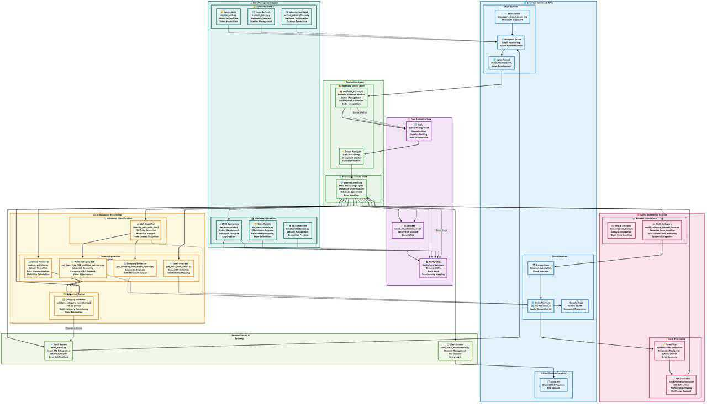

# AI-Powered Insurance Quotation System

## 🎯 Project Overview
This project is an intelligent insurance quotation system that automates the entire quote generation process. It monitors incoming emails, extracts relevant documents (trade licenses, benefits tables, census files), processes them using AI, and generates professional insurance quotation PDFs automatically.

### 🔄 System Workflow
1. **Email Monitoring**: System monitors a designated email inbox using Microsoft Graph API webhooks
2. **Document Processing**: AI extracts and processes three key documents:
   - Trade License (for company information)
   - Table of Benefits/TOB (for benefit details) - **Supports multiple categories (A, B, C)**
   - Census File (for employee demographics)
3. **Initial Validation**: The system extracts and validates the policy start date from the email. If the date is in the past, the process is halted and a notification is sent requesting an updated date.
4. **Quote Generation**: Automated browser automation fills quote forms and generates PDFs
Table of Benefits/TOB (for benefit details) - Supports multiple categories (A, B, C)
Census File (for employee demographics)
5. **Delivery**: Generated quotes are delivered via email/Slack notifications

## 🏗️ System Architecture
```
Email Inbox → Webhook Server → Redis Queue → Document Processing → Quote Generation → PDF Delivery
     ↓              ↓              ↓              ↓                   ↓              ↓
MS Graph API → webhook_server.py → Queue Management → process_email.py → Browser Automation → Email/Slack
```



## 🚀 Getting Started

### Prerequisites
- Python 3.13+
- Microsoft Azure account with Graph API access
- Google Cloud Platform account (for storage)
- Google Gemini AI API key
- Browserbase account (for browser automation)
- PostgreSQL database
- Redis server (for queue management)
- ngrok (for webhook tunneling)

### 📦 Installation

1. **Clone the repository**
   ```bash
   git clone https://github.com/Wellx-AI/quotation-ai.git
   cd quotation-ai
   ```

2. **Install dependencies**
   ```bash
   pip install -r requirements.txt
   ```

3. **Environment Setup**
   Create a `.env` file in the root directory:
   ```env
   # Wellx website login credentials
   EMAIL=your-admin-email@domain.com
   PASSWORD=your-admin-password
   
   # AI API Keys
   GEMINI_API_KEY=your-gemini-api-key
   
   # Browserbase Configuration
   BROWSERBASE_API_KEY=your-browserbase-api-key
   PROJECT_ID=your-browserbase-project-id
   
   # Slack Integration
   SLACK_API_KEY=your-slack-bot-token
   
   # Microsoft Azure/Graph API Configuration
   TENANT_ID=your-azure-tenant-id
   CLIENT_ID=your-azure-client-id
   CLIENT_SECRET=your-azure-client-secret
   
   # Google Cloud Storage Configuration
   GCS_BUCKET_NAME=your-gcs-bucket-name
   GCS_AUTH_JSON_FILE=path-to-your-service-account.json
   
   # PostgreSQL Database Configuration
   DB_USER=your-database-username
   DB_PASSWORD=your-database-password
   DB_NAME=your-database-name
   DB_HOST=your-database-host
   DB_PORT=your-database-port
   
   # Redis Configuration
   REDIS_URL=redis://localhost:6379
   ```

4. **Azure/Microsoft Graph Setup**
   - Register an application in Azure AD
   - Configure appropriate permissions for Mail.Read and Mail.Write in delegated permissions
   - Run device code flow authentication:
   ```bash
   python device_auth.py
   ```

5. **Google Cloud Setup**
   - Create a GCS bucket for email attachments
   - Download service account key as JSON file
   - Update GCS_AUTH_JSON_FILE path in .env

6. **Database Setup**
   - Set up PostgreSQL database
   - Configure connection details in .env file
   - The system uses SQLAlchemy models defined in `database/models.py`

7. **Redis Setup**
   - Install and start Redis server
   - Configure REDIS_URL in .env file

## 🖥️ Running the System

### Step 1: Start Redis Server
```bash
# Start Redis server (if not running as service)
redis-server
```

### Step 2: Start the Webhook Server (Primary)
```bash
# Terminal 1: Start the webhook server with Redis queue management
python main.py webhook
```

### Step 3: Start the Email Processing Server
```bash
# Terminal 2: Start the email processing API
python main.py processor
```

### Step 4: Setup ngrok Tunnel
```bash
# Terminal 3: Create ngrok tunnel
ngrok http 8000
# Copy the generated URL (e.g., https://abc123.ngrok-free.app)
```

### Step 5: Register Webhook Subscription
```bash
# Edit WEBHOOK_URL = "https://your-ngrok-url.ngrok-free.app/email-sub"
# Run command with edited --webhook-url 
python setup_subscription.py --webhook-url "https://d2a9-182-185-130-154.ngrok-free.app/email-sub"
```

### Step 6: Monitor System
The system is now running with:
- **Redis-based queue management** with max 3 concurrent processing
- **Automatic retry mechanisms**
- **Real-time status monitoring**

Check queue status at: `http://localhost:8000/queue-status`

## 📁 Key Files and Their Purpose

### Core System Files
| File | Purpose |
|------|---------|
| **webhook_server.py** | Main webhook handler with Redis queue management |
| **process_email.py** | Comprehensive email processing with database logging |
| **main.py** | Legacy FastAPI server (replaced by process_email.py) |
| **database/models.py** | SQLAlchemy database models |
| **database/crud.py** | Database operations and queries |
| **database/database.py** | Database connection and session management |

### AI Processing Modules
| File | Purpose |
|------|---------|
| **get_company_from_trade_license.py** | Extracts company name from trade license PDFs |
| **get_json_from_TOB_multiple_category.py** | **Main TOB processor** - handles multi-category benefit tables with detailed reasoning |
| **get_json_from_TOB.py** | Single category TOB processor (legacy) |
| **get_data_from_email.py** | Extracts broker/relationship manager info from emails |
| **get_markdown_from_pdf.py** | Converts PDFs to markdown format |
| **smart_ai_selection.py** | AI select the option from the browser base aution if actual value is miss matched.

### Data Processing
| File | Purpose |
|------|---------|
| **replace_entities.py** | Standardizes census data formats with intelligent column detection |
| **get_census_csv.py** | Advanced census file processing with statistics |
| **get_census_json.py** | Converts standardized census to JSON format |
| **calculate_stats.py** | Calculates detailed demographic statistics |

### Browser Automation
| File | Purpose |
|------|---------|
| **multi_category_browser_base.py** | **Primary browser automation** - handles multiple categories with advanced error handling |
| **test_browser_base.py** | Single category browser automation (legacy) |

### Communication & Notifications
| File | Purpose |
|------|---------|
| **send_email.py** | Email notifications via Microsoft Graph API |
| **send_slack_notifications.py** | Slack channel notifications with retry logic |

### Authentication & Utilities
| File | Purpose |
|------|---------|
| **device_auth.py** | Microsoft device code authentication flow |
| **refresh_token.py** | Token refresh management |
| **active_subscriptions.py** | Webhook subscription management |
| **upload_to_gcp.py** | Google Cloud Storage operations |

## 🔧 Configuration

### Email Processing Rules
The system expects emails with **minimum 3 attachments**:
1. **Trade License (PDF)** - Company information extraction
2. **Table of Benefits (PDF)** - Insurance benefit details (supports multiple categories)
3. **Census File (Excel/CSV)** - Employee demographics

**New Features:**
- **Intelligent PDF classification** using LLM
- **Multiple TOB files support** (TOB-A, TOB-B, TOB-C)
- **Category validation** between census and TOB files
- **Forwarded email detection**

### Broker Name Mapping
Comprehensive broker list including:
```
AES, Al Manarah, Al Raha, Al Rahaib, Al Sayegh, Al Nabooda Insurance Brokers,
Aon International, Aon Middle East, Bayzat, Beneple, Burns & Wilcox, Care,
Compass, Crisecure, Deinon, Direct Sale, E-Sanad, European, Fisco, Gargash,
Howden, Indemnity, Interactive, Kaizzen Plus, Lifecare, Lockton, Marsh Mclenann,
Medstar, Metropolitan, Myrisk Advisors, Nasco, Nasco Emirates, New Sheild,
Newtech, Nexus, Omega, Pacific Prime, Pearl, Prominent, PWS, RMS, Seguro,
UIB, Unitrust, Wehbe, Willis Towers Watson, Wellx.ai, and many more...
```
- Default: "AES" if no match found

### Relationship Manager Mapping
Maps to: **"Hishaam", "Shikha", "Sabina", "Sujith"**
- Default: "Sabina" if no match found

## 🎛️ Advanced System Features

### Intelligent Document Processing
- **Multi-format Support**: PDF, Excel (.xlsx, .xls, .xlsm), CSV files
- **AI-Powered Classification**: LLM-based document type detection
- **Multi-Category TOB Support**: Handles Category A, B, C benefit tables
- **Data Validation**: Cross-validation between census categories and TOB files
- **Format Standardization**: Intelligent column detection and data normalization 

### Advanced Email Handling
- **Redis Queue Management**: Concurrent processing with configurable limits
- **Deduplication**: Business-key based duplicate prevention
- **Forwarded Email Detection**: Extracts original sender information
- **Attachment Validation**: Comprehensive file type and content validation
- **Error Notifications**: Detailed error messages with specific resolution steps

### Quote Generation
- **Multi-Category Browser Automation**: Handles complex forms with multiple benefit categories
- **Space-Insensitive Matching**: Robust form field selection
- **Dynamic PDF Generation**: Professional quotation documents with embedded CSS
- **Form Validation**: Real-time validation during data entry
- **Error Recovery**: Automatic retry mechanisms and fallback strategies

### Cloud Integration & Performance
- **Google Cloud Storage**: Secure document storage with signed URLs
- **Microsoft Graph API**: Complete email lifecycle management
- **PostgreSQL Database**: Comprehensive logging and audit trails
- **Redis Queue System**: High-performance message queue with monitoring
- **Browserbase Integration**: Reliable browser automation in the cloud

### Database Schema
```sql
-- Core entities with relationships
Brokers → BrokerEmployees
RelationshipManagers → Quotations
Quotations → Logs (audit trail)

-- Quotation statuses: RECEIVED, PROCESSING, COMPLETED, FAILED, DELIVERED
-- Comprehensive logging for debugging and monitoring
```

## 🐛 Troubleshooting

### Common Issues

1. **Webhook Not Receiving Notifications**
   ```bash
   # Check active subscriptions
   python active_subscriptions.py
   
   # Verify ngrok tunnel
   curl https://your-ngrok-url.ngrok-free.app/queue-status
   ```

2. **Queue Processing Issues**
   ```bash
   # Check queue status
   curl http://localhost:8000/queue-status
   
   # Clear stuck queues
   curl http://localhost:8000/clear-queue
   ```

3. **Category Mismatch Errors**
   - Ensure census file categories match TOB file categories
   - Check that multiple TOB files cover all census categories
   - Verify category naming consistency (A, B, C)

4. **Browser Automation Issues**
   - Check Browserbase session limits
   - Verify form selectors are current
   - Monitor session release in logs

5. **Database Connection Issues**
   ```bash
   # Test database connection
   python -c "from database.database import get_db_session; db = get_db_session(); print('DB OK')"
   ```

## 📊 Monitoring and Maintenance

### Real-time Monitoring
```bash
# Queue status and statistics
curl http://localhost:8000/queue-status

# Processing metrics
{
  "queue_stats": {
    "total_queued": 150,
    "total_processed": 142,
    "currently_processing": 2,
    "queue_size": 6,
    "completed_count": 138,
    "failed_count": 4
  },
  "currently_processing": [...],
  "max_concurrent": 3
}
```

### Active Subscription Management
```bash
# List and clean up subscriptions
python active_subscriptions.py
```

### Database Monitoring
- Track quotation processing times
- Monitor error rates by broker
- Analyze category mismatch patterns
- Review PDF generation success rates

## 🔒 Security Features

- **Environment-based Configuration**: All sensitive data in .env files
- **Signed URLs**: Temporary, secure file access
- **Comprehensive Error Handling**: No data leaks in error responses
- **Token Management**: Automatic refresh and secure storage
- **Database Security**: Parameterized queries and connection pooling
- **Audit Logging**: Complete operation trail in database

## 🚧 Development and Testing

### Testing Individual Components
```bash
# Test document processing
python get_company_from_trade_license.py
python get_json_from_TOB_multiple_category.py

# Test census processing with statistics
python calculate_stats.py

# Test email extraction
python get_data_from_email.py

# Test browser automation
python multi_category_browser_base.py
```

### Development Workflow
1. **Modular Architecture**: Each component is independently testable
2. **Error Handling**: Comprehensive exception handling throughout
3. **Database Integration**: All operations logged for debugging
4. **Configuration Management**: Environment-based configuration
5. **Testing**: Individual component testing before integration

## 📈 Performance Optimization

### Queue Management
- **Redis-based Processing**: High-performance message queue
- **Concurrent Processing**: Configurable concurrent limits (default: 3)
- **Background Processing**: Non-blocking webhook responses
- **Automatic Retry**: Built-in retry mechanisms for failed operations

### Resource Management
- **File Cleanup**: Automatic temporary file cleanup
- **Memory Management**: Efficient file processing and cleanup
- **Database Optimization**: Connection pooling and query optimization
- **API Rate Limiting**: Proper handling of API quotas and limits

### Caching and Deduplication
- **Email Caching**: Business-key based duplicate prevention
- **Message Tracking**: Processed message ID tracking
- **Content Deduplication**: Intelligent duplicate content detection

## 🔄 Data Flow Architecture

```
Email → Webhook → Redis Queue → Document Processing → AI Analysis → Database → Quote Generation → PDF → Delivery
  ↓         ↓          ↓              ↓                ↓            ↓            ↓           ↓         ↓
Graph API → FastAPI → Queue Mgmt → Multi-Doc Parse → Gemini AI → PostgreSQL → Browser → GCS → Email/Slack
```

### Processing Pipeline
1. **Webhook Receipt**: Immediate response, background queuing
2. **Queue Management**: Redis-based FIFO processing with concurrency limits
3. **Document Classification**: LLM-based intelligent document type detection
4. **Content Extraction**: Parallel processing of multiple documents
5. **Category Validation**: Cross-validation between census and TOB categories
6. **Database Logging**: Comprehensive audit trail throughout process
7. **Quote Generation**: Multi-category browser automation
8. **PDF Creation**: Professional document generation with embedded styling
9. **Delivery**: Multi-channel notification (email + Slack)

## 🎯 Recent Enhancements

### Multi-Category Support
- **Multiple TOB Files**: Process Category A, B, C benefit tables simultaneously
- **Category Validation**: Ensure consistency between census and TOB categories
- **Intelligent Matching**: Space-insensitive form field matching
- **Error Recovery**: Graceful handling of missing or mismatched categories

### Enhanced Error Handling
- **Detailed Error Messages**: Specific resolution steps for common issues
- **Category Mismatch Detection**: Early validation with helpful error messages
- **Retry Mechanisms**: Automatic retry for transient failures
- **Graceful Degradation**: Fallback strategies for partial failures

### Improved Monitoring
- **Real-time Queue Status**: Live monitoring of processing pipeline
- **Database Audit Trail**: Complete operation logging for debugging
- **Performance Metrics**: Processing time and success rate tracking
- **Health Checks**: Endpoint monitoring for system health
---

**Note**: This system processes sensitive financial and personal data. Ensure compliance with relevant data protection regulations in your jurisdiction. The system includes comprehensive logging and audit trails for compliance monitoring.